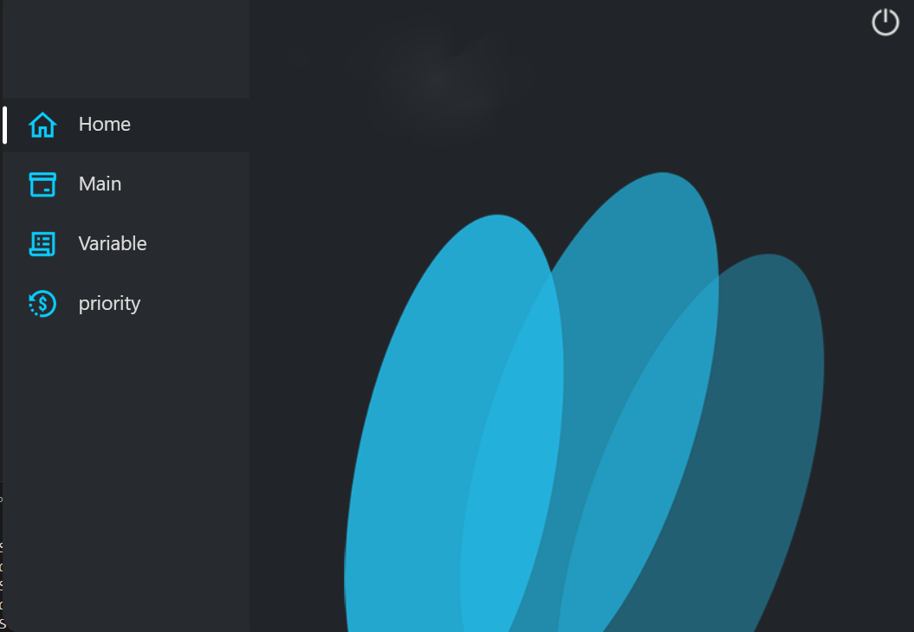
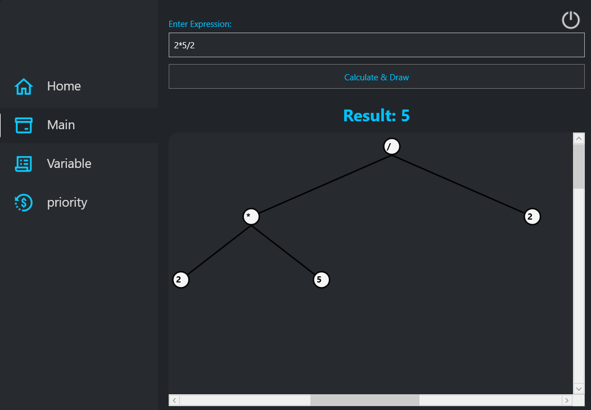
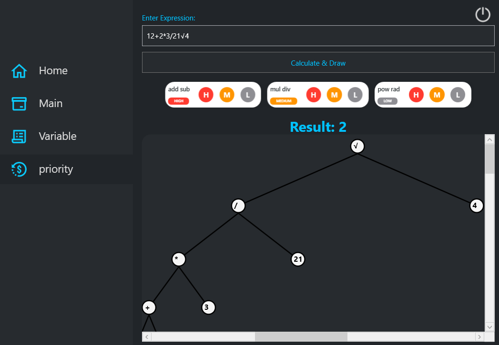

# 📐 Expression Graph Calculator

> A next-gen WPF calculator that visualizes mathematical expressions as dynamic graphs — with full MVVM architecture and customizable operator priorities.


---

## 📋 Table of Contents

- [Overview](#-overview)
- [Features](#-features)
- [Architecture](#-architecture)
- [Tech Stack](#-tech-stack)
- [Getting Started](#-getting-started)
- [How to Use](#-how-to-use)
- [Screenshots](#-screenshots)
- [Music Credit](#-music-credit)
- [Future Improvements](#-future-improvements)
- [Contributing](#-contributing)
- [License](#-license)
- [Acknowledgments](#-acknowledgments)

---

## 🎯 Overview

**GraphCalc Pro** is not your average calculator. It evaluates mathematical expressions while simultaneously **rendering the computation flow as an interactive graph**. Built with **WPF** and **MVVM** architecture, it combines functionality with stunning visuals — all backed by the calming vibes of *Aria Math* for the perfect coding experience.

This project was developed as part of my **Data Structures and Algorithms** course, showcasing how graph theory can be applied to real-world applications like expression evaluation.

---

## ✨ Features

### 🧮 Smart Calculation Engine

- Supports **basic arithmetic**: `+`, `-`, `*`, `/`, `^`
- Customizable **operator priority**: Change precedence of `*`, `+`, `^`, etc. on the fly
- Handles **parentheses** and complex nested expressions
- Error handling for invalid inputs

### 📊 Graph Visualization

- Visualizes the **calculation tree** as an interactive graph
- Each node represents an operation or value
- Edges show data flow and evaluation order
- Zoomable, draggable, and beautifully styled with smooth animations

### 🎨 UI / UX

- **MVVM architecture**: Clean, testable, maintainable code
- **Modern WPF design** with smooth animations and transitions
- **Dark theme** optimized for focus and long coding sessions
- Built-in **Aria Math** background music (toggle on/off)

### ⚙️ Customizable Priorities

Ever wanted `+` to have higher priority than `*`? Now you can!  
Use the **Priority Editor** to define your own operator precedence rules dynamically.

---

## 🧠 Architecture

```
┌─────────────────────────────────────────────────────┐
│                       View                          │
│              (XAML + Data Binding)                  │
├─────────────────────────────────────────────────────┤
│                    ViewModel                        │
│           (Commands, State, Logic)                 │
├─────────────────────────────────────────────────────┤
│                     Model                          │
│      (Expression Evaluator + Graph Engine)         │
└─────────────────────────────────────────────────────┘

```

## Data Structures Concepts

This project applies several core DSA concepts:

- Expression Trees
- Graph Traversal
- Parsing Algorithms
- Priority Management
- Tree-Based Expression Evaluation


### Components

| Layer | Responsibility |
|-------|----------------|
| **Model** | Expression parser, operator priority system, graph generation algorithm |
| **ViewModel** | Mediates between UI and Model using `INotifyPropertyChanged` & `ICommand` |
| **View** | Fully data-bound XAML with animations and custom controls |

---

## 🛠️ Tech Stack

| Component | Technology |
|-----------|------------|
| UI Framework | WPF (.NET) |
| Architecture | MVVM |
| Language | C# |
| Graph Rendering | Custom Canvas / LiveCharts |
| Audio | MediaPlayer / NAudio |
| Dependency Injection | Microsoft.Extensions.DependencyInjection |

---

## 🚀 Getting Started

### Prerequisites

- Windows 10/11
- [.NET 6.0+](https://dotnet.microsoft.com/download) or .NET Framework 4.7.2+
- Visual Studio 2022+ (recommended)

### Installation

```bash
# Clone the repository
git clone https://github.com/amirreza-khaleghverdi/ExpressionGraph.git

# Navigate to the project folder
cd ExpressionGraph

# Build the project
dotnet build

# Run the application
dotnet run
```

Or just open the `.sln` file in Visual Studio and hit **F5**.

---

## 🎮 How to Use

1. **Enter an expression** in the input field  
   Example: `(3 + 5) * 2 ^ 3`

2. **Hit Calculate** — see the result and the graph appear instantly

3. **Drag nodes** to rearrange the graph view for better visualization

4. **Change priorities** — click the "Priority" button and drag operators to reorder them

5. **Toggle background music** — yes, it plays *Aria Math*. Yes, it's optional.

---

## 📸 Screenshots

> *Add screenshots here!*

### Main Calculator View


### Graph Visualization


### Priority Editor


---

## 🎵 Music Credit

Background music: **Aria Math** by *C418*  
From *Minecraft — Volume Beta*  
Used for educational/non-commercial purposes.

---

## 📌 Future Improvements

- [ ] Save graphs as images (PNG/SVG)
- [ ] Export calculations as CSV
- [ ] Support for functions (`sin`, `cos`, `log`, `sqrt`)
- [ ] Light theme toggle
- [ ] Unit testing for expression parser
- [ ] Keyboard shortcuts for faster input
- [ ] History of calculations

---

## 🤝 Contributing

Pull requests are welcome! For major changes, please open an issue first to discuss what you'd like to change.

1. Fork the repository
2. Create your feature branch (`git checkout -b feature/AmazingFeature`)
3. Commit your changes (`git commit -m 'Add some AmazingFeature'`)
4. Push to the branch (`git push origin feature/AmazingFeature`)
5. Open a Pull Request

---

## 📄 License

[MIT](LICENSE) © [Amirreza Khaleghverdi]

---

## 📬 Contact

[Your Name] - [your.email@example.com](mailto:your.email@example.com)

Project Link: [https://github.com/amirreza-khaleghverdi/ExpressionGraph](https://github.com/amirreza-khaleghverdi/ExpressionGraph)

---

**Made with ❤️, C#, and way too much coffee**
